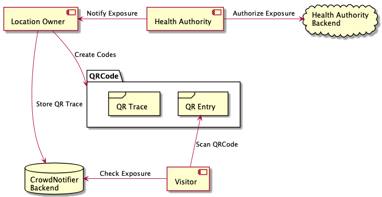
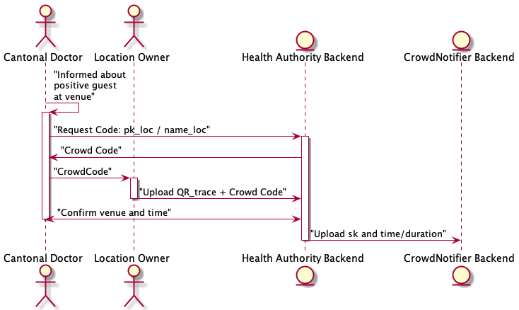

# CrowdNotifier - Decentralized Privacy-Preserving Presence Tracing

This repository puts forward a proposal for a secure, decentralized,
privacy-preserving presence tracing system. Our proposal aims to simplify and
accelerate the process of notifying individuals that shared a semi-public
location with a SARS-CoV-2-positive person for a prolonged time without
introducing new risks for users and locations. Existing proximity tracing
systems (apps for contact tracing such as SwissCovid, Corona Warn App, and
Immuni) notify only a subset of these people: those that were close enough for
long enough. Current events have shown the need to notify _all_ people that
shared a space with a SARS-CoV-2-positive person. The proposed system aims to
provide an alternative to increasing use of apps with similar intentions based
on invasive collection or that are prone to abuse by authorities. Our
preliminary design aims to minimize privacy and security risks for individuals
and communities, while guaranteeing the highest level of data protection and
good usability and deployability.

With this proposal, we seek feedback from a broad audience on the high-level
design, its security and privacy properties, and the functionality it offers, so
that the merits of the design can be discussed, and protection mechanisms can be
added to correct weaknesses. We feel it is essential that designs be made public
so the community as a whole can discuss the proposal and verify the claimed
privacy guarantees before applications are deployed.

## Repositories

The following repositories hold further information about the project:

* Android SDK: [crowdnotifier-sdk-android](https://github.com/CrowdNotifier/crowdnotifier-sdk-android)
* iOS SDK: [crowdnotifier-sdk-ios](https://github.com/CrowdNotifier/crowdnotifier-sdk-ios)
* TypeScript Reference Implementation and library: [libcrowdnotifier](https://github.com/CrowdNotifier/libcrowdnotifier)
* Android Demo App: [notifyme-app-android](https://github.com/notifyme-app/notifyme-app-android)
* iOS Demo App: [notifyme-app-ios](https://github.com/notifyme-app/notifyme-app-ios)
* Backend SDK: [notifyme-sdk-backend](https://github.com/notifyme-app/notifyme-sdk-backend)
* QR Generator Web App: [notifyme-qrgenerator-web](https://github.com/notifyme-app/notifyme-qrgenerator-web)
* QR Landing Page Web App: [notifyme-qrlandingpage-web](https://github.com/notifyme-app/notifyme-qrlandingpage-web)
* QR Trace Upload Web App: [notifyme-upload-web](https://github.com/notifyme-app/notifyme-upload-web)

## Work in Progress

The CrowdNotifier protocol underwent changes to improve its security and privacy properties. See 
[CrowdNotifier](https://github.com/CrowdNotifier/documents) for updates on the design. 
This reference implementation reflects the latest changes as of 2020/12/17

# CrowdNotifier Reference Implementation

In order to show the different parts of CrowdNotifier from a programming point of view, this demo implements the full
 chain of the CrowdNotifier project as different classes.
If you want to see how it works, go to https://stackblitz.io/edit/crowdnotifier?file=index.ts
As the current repo is private, stackblitz cannot reference it directly.
This reference implementation has been made possible by the [C4DT](https://c4dt.org).

The following figures show the different components of the system:



This figure shows the steps to publish a trace location:

 

## Goal of the demo

- Reference implementation of the description in the white paper
- Being able to print intermediate results for test data
- Insert test data from the main
- Test with different versions of the QRCode
- Offer a library for other apps

## Directories

- [lib](lib/README.md) - the library of the v2 version, including the old v1 and v1_1 for reference
- [app](app/README.md) - example of how to use the library in an app

## Starting the tests

To start the tests of the library, run the following commands:

```
cd lib
npm ci -D
npm run test
```

For the tests of the app, go into the app-directory, and do the same:

```
cd app
npm ci -D
npm run test
```

# Library usage

To use the library, first you need to install it:

```
npm i -S @c4dt/libcrowdnotifier
```

If you're using libsodium or mcl in your own app, be sure to import them from the libcrowdnotifier
package! This is a limitation due to the fact that both libsodium and mcl need to initialize first.
If you're using your own libsodium and mcl imports, node will treat them as a separate package!

# Versions

- 1.1.0 - 21/03/12 - Allow the manager to drop the secret of the partial HA key
- 1.0.9 - 21/01/17 - Correctly set notificationKey and message and remove unused protobufs
- 1.0.8 - 21/01/13 - Build fixes, better creation of app-classes: Organizer, HealthAuthority
- 1.0.7 - 21/01/11 - Add Organizer method to use managed mode
- 1.0.5 - 21/01/08 - Adding test-vectors, better field names in protobufs
- 1.0.3 - 21/01/05 - Update the types
- 1.0.0 - 20/12/17 - First version 

# Contributing

Everyone interacting on the CrowdNotifier projects codebases, issue trackers, etc. is expected to follow the [code
  of conduct](CODE_OF_CONDUCT.txt).

# License

This project is licensed under the terms of the MPL 2 license. See the [LICENSE](LICENSE) file.
